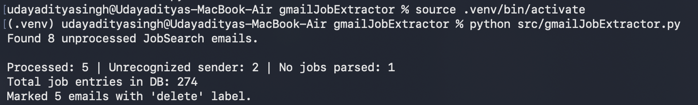

# 📧 Gmail Job Extractor

I was overwhelmed by the number of job board notification emails coming in my inbox. Too many unheard of companies (startups, etc.) and too many senders (LinkedIn, Hireist, Naurki, etc.).

My biggest pain was that I did not know which of these companies was I interested in, and should network with more. Now that I write this, I realise that an easier workflow would be laizzes faire, where I just go through my email (with the label= JobSearch), individually read about companies, and start 1) applying, 2) networking with people in them.

However, considering the large amount of noise in these emails, I decided to just write this basic scrapper in python.

## ✨ What it does

1. One-time connect securely to your Gmail app (read access only). This is just like any other app where there is an SSO screen and you log in via gmail.

2. Once connected, and script is run, it reads emails with the label `JobSearch`. This is a simple label to narrow down what the script reads.
   * You can create a `JobSearch` label within Gmail.

3. Once read, the script identifies sender and extracts job postings (role, company, etc.) and stores it in the `jobs.db` sqlite database.

4. Finally, the emails that have been catured, are labelled `delete` so that user can review & delete these in bulk without going through them.

```
┌─────────────────┐
│   Gmail Inbox   │  (With JobSearch label)
└────────┬────────┘
         │
         ↓
┌──────────────────────────┐
│  gmail_job_extractor.py  │  Identifies sender & extracts jobs
└────────┬─────────────────┘
         │
         ├─→ Finds: Role, Company, Location, Experience
         │
         ↓
┌──────────────────────────┐
│  jobs.db (SQLite)        │  Structured job data (Database)
└──────────────────────────┘
         ↑
         │
         └─ Emails auto-labeled "delete"
```

**New in v1.1:** SQLite database for better scalability, data querying, and the `--debug` & `--export` flags for transparency and portability.

### Supported senders (for now)
- ✅ LinkedIn Job Alerts
- ✅ Hirist
- ✅ Naukri

### Edge cases:
- Unknown sender? Skipped, label stays clean (you'll spot it manually)
- Parser didn't match anything? Skipped, label untouched (template may have changed—time to adjust)

## 📸 See it in action

|**Before**|**After**|
|---|---|
|54 emails in my inbox waiting to be processed |Structured job data in `jobs.db`, ready to use. |


## 🚀 Quick Start

### Prerequisites
Before you start, make sure you have:
- **Python 3.7+** installed. Check by opening Terminal and running `python3 --version`. If you don't have it, [install Python here](https://www.python.org/downloads/).
- **Git** installed (to download this repo). Check with `git --version`. If you don't have it, [install Git here](https://git-scm.com/downloads).
- A **Gmail account** with job notification emails you want to organize.

### 1. Download this repo
Open Terminal and run:
```bash
git clone https://github.com/PhantomMajor/gmailJobExtractor.git
cd gmailJobExtractor
```

**Don't have git?** Download the ZIP instead: go to https://github.com/PhantomMajor/gmailJobExtractor → click the green "Code" button → "Download ZIP" → extract it → open Terminal in that folder.

### 2. Create a virtual environment (optional but recommended)
This keeps your Python setup clean and separate from your system:
```bash
python3 -m venv .venv
source .venv/bin/activate
```
You'll see `(.venv)` appear in Terminal, meaning you're in the isolated environment. Run `source .venv/bin/activate` this every time you open a new Terminal window to work on this project.

example- 

### 3. Install dependencies
This downloads and installs the Python libraries this script needs:
```bash
pip install -r requirements.txt
```

### 4. (ONE TIME) Set up Gmail API access
This is a one-time setup so the script can securely read your Gmail.

**Step A:** Go to [console.cloud.google.com](https://console.cloud.google.com) and sign in with your Gmail account.

**Step B:** Create a new project (top-left dropdown → "New Project" → pick a name like "JobExtractor").

**Step C:** Enable the Gmail API:
   - Left sidebar → "APIs & Services" → "Library"
   - Search for "Gmail API"
   - Click it, then click "Enable"

**Step D:** Create credentials (this is how the script proves it's allowed to access Gmail):
   - Left sidebar → "APIs & Services" → "Credentials"
   - Click "+ Create Credentials" → "OAuth client ID"
   - If it asks to configure the consent screen first, click "Configure consent screen"
     - Choose "External"
     - Fill in the app name (`JobExtractor`)
     - Add your Gmail as a test user
     - Save and continue (you don't need a review)
   - Back to creating credentials: Choose "Desktop app" as the application type
   - Click "Create"
   - A popup appears → Click "Download" and save the JSON file

**Step E:** Save the credentials file:
   - Rename the downloaded file to `credentials.json`
   - Move it into your `gmailJobExtractor` folder (the one you cloned in Step 1)

### 5. Run the script
```bash
python src/gmailJobExtractor.py
```
First run will open your browser asking you to approve access—sign in with your Gmail. After approval, the script:
- Creates `token.json` (so you won't need to log in again)
- Reads emails labeled `JobSearch` from your Gmail
- Extracts job info and saves it to `jobs.db` (a database file)
- Labels those emails as `delete` so you can review & delete them in bulk

Don't have a `JobSearch` label yet? Create one in Gmail (left sidebar → "Create new label" → type "JobSearch"). Then move your job notification emails there.

### 6. Optional: Use flags for more control
```bash
python src/gmailJobExtractor.py --debug        # Show what the script extracted before saving
python src/gmailJobExtractor.py --export out.json  # Save all jobs to a JSON file
```

## 🗺 Roadmap (v1.* planned)

These are coming soon—no API tokens needed, just smarter automation:

|version|feature|note|
|---|---|---|
|**v1.1**|Swap JSON for SQLite database (better for large datasets).|_Now live with `--debug` & `--export` flags_|
|**v1.2**|Auto-delete without human-in-loop (the script marks emails for deletion, not just labeling)|not yet started|
|**v1.3**|Add cron job support (runs on a schedule, no manual trigger)|-|


## 🤝 Contributing
This is v1, and there's a lot of room to grow. Here's how you can help:

### Ideas
- Add support for new job email senders (Indeed, Wellfound, etc.)
- Improve parsing accuracy or add new fields (e.g., salary, job type)
- Test edge cases and report bugs
- Share your roadmap ideas

### Code contributions
1. **Fork & branch** (`feature/new-sender`, `fix/parser-bug`, etc.)
2. **Test your changes** (run the script, verify `extracted_jobs.json`)
3. **Open a PR** with a description of what you changed and why

No experience needed—if you're fixing something that bothered you, that's a great PR.

## 📝 License

MIT License - See [LICENSE](LICENSE) for details. Yours to use, modify, and share. Build on it!

**Questions?** [Open an issue](../../issues). **Found a bug?** Same place.  

**Built something cool with this?** Let me know—I'd love to see it!
