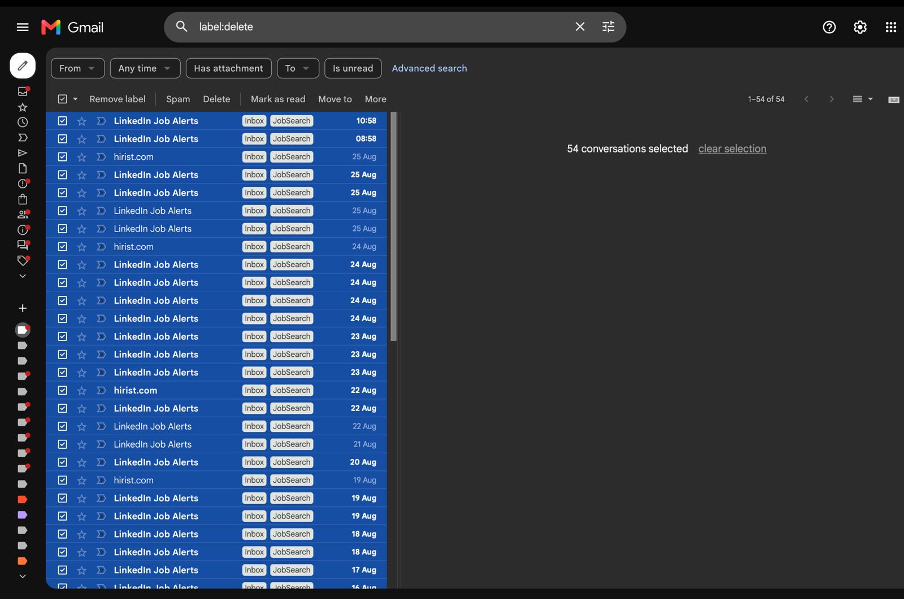
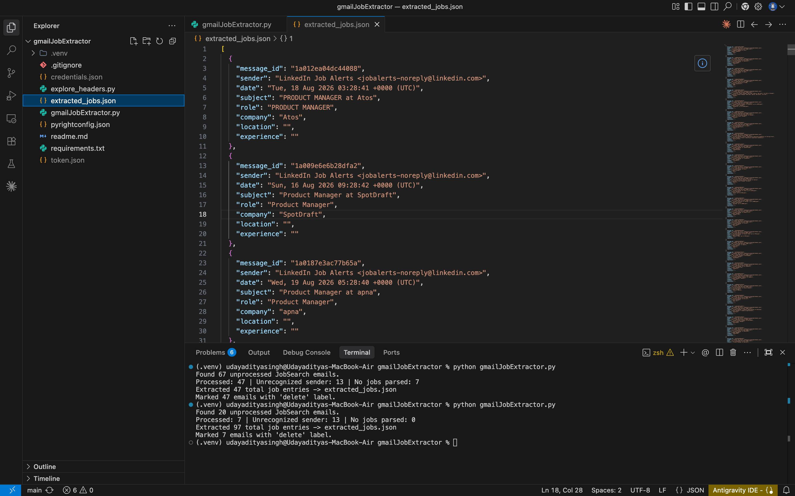

```
╭─────────────────────────────────────────╮
│  📧 Gmail Job Extractor                 │
│  Automate your job hunting emails       │
╰─────────────────────────────────────────╯
```

Stop copy-pasting job listings. Let this script do it for you.

## ✨ What it does

```
┌─────────────────┐
│   Gmail Inbox   │  (With JobSearch label)
└────────┬────────┘
         │
         ↓
┌──────────────────────────┐
│  gmail_job_extractor.py  │  Identifies sender & extracts jobs
└────────┬─────────────────┘
         │
         ├─→ Finds: Role, Company, Location, Experience
         │
         ↓
┌──────────────────────────┐
│  extracted_jobs.json     │  Structured job data (JSON)
└──────────────────────────┘
         ↑
         │
         └─ Emails auto-labeled "ReadyToDelete"
```

**The payoff?** 54 job emails extracted and organized in seconds. No manual copy-pasting.

### Supported senders (for now)
- ✅ LinkedIn Job Alerts
- ✅ Hirist

---

## 📸 See it in action

**Before:** 54 emails in your inbox waiting to be processed  


**After:** Structured job data in `extracted_jobs.json`, ready to use or delete  


---

## 🚀 Quick Start

### 1. Google Cloud setup
   - Go to [console.cloud.google.com](https://console.cloud.google.com), create or pick a project
   - Enable the **Gmail API** (APIs & Services → Library)
   - Configure OAuth consent screen: "External" + "Testing", add your Gmail as test user (no review needed!)
   - Create credentials → OAuth client ID → **Desktop app**
   - Download JSON, save as `credentials.json` in this repo

### 2. Install dependencies
   ```bash
   pip install -r requirements.txt
   ```

### 3. Run
   ```bash
   python gmail_job_extractor.py
   ```
   First run opens a browser for approval (same account with `JobSearch` label). Creates `token.json` for future runs—no repeated logins.

---

## 🎯 How it works

**On each run:**
- Scans Gmail for emails labeled `JobSearch` (without `ReadyToDelete`)
- Parses job listings from the email body
- Appends to `extracted_jobs.json`
- Marks processed emails with `ReadyToDelete` label

**Edge cases:**
- Unknown sender? Skipped, label stays clean (you'll spot it manually)
- Parser didn't match anything? Skipped, label untouched (template may have changed—time to adjust)

---

## 🛠 Extend to a new sender

1. Create a `parse_<sender>(text, subject)` function
2. Return a list of dicts: `{"role", "company", "location", "experience"}`
3. Register the sender domain in the `PARSERS` dict

---

## 🗺 Roadmap (v1.* planned)

These are coming soon—no API tokens needed, just smarter automation:

- [ ] **v1.1** | Swap JSON for SQLite database (better for large datasets)
- [ ] **v1.2** | Auto-delete without human-in-loop (the script marks emails for deletion, not just labeling)
- [ ] **v1.3** | Add cron job support (runs on a schedule, no manual trigger)

Each keeps the same simple, token-free workflow. This is just the beginning.

---

## 🤝 Contributing

This is v1, and there's a lot of room to grow. Here's how you can help:

### Ideas
- Add support for new job email senders (Indeed, Wellfound, etc.)
- Improve parsing accuracy or add new fields (e.g., salary, job type)
- Test edge cases and report bugs
- Share your roadmap ideas

### Code contributions
1. **Fork & branch** (`feature/new-sender`, `fix/parser-bug`, etc.)
2. **Test your changes** (run the script, verify `extracted_jobs.json`)
3. **Open a PR** with a description of what you changed and why
4. **Add screenshots** (use `blur_screenshots.py` to hide sensitive info):
   ```bash
   python blur_screenshots.py before.png after.png \
     --regions 10,50,500,30 600,100,200,50
   ```

No experience needed—if you're fixing something that bothered you, that's a great PR.

---

## 📝 License

Yours to use, modify, and share. Build on it!

---

**Questions?** [Open an issue](../../issues). **Found a bug?** Same place.  
**Built something cool with this?** Let me know—I'd love to see it!